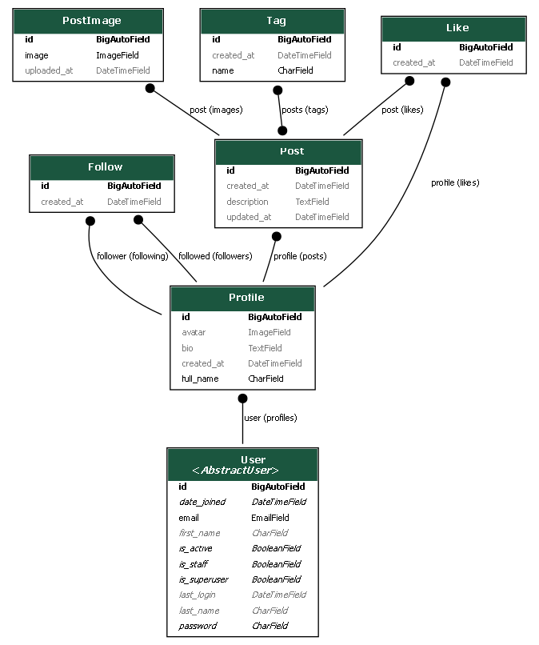

# DjangoGramm

An Instagram-style social photo application built with Django 5.2, deployed on
Google Cloud Run.

**Live:** https://djangogramm-979108818780.europe-west3.run.app

Sign in with the demo account, or register with your own email, GitHub or
Google:

```
demo@djangogramm.dev / demo-password-123
```

---

## What it does

- **Email registration** with a confirmation link — accounts stay inactive until
  the address is verified
- **Social login** via GitHub and Google
- **Multiple profiles per user**, each with its own name, bio, avatar, posts and
  followers
- **Posts with several images and tags**, where authors can create new tags as
  they write
- **Likes and follows**, updating in place without a page reload
- **A news feed** of posts from profiles you follow, plus your own
- **Discover** page for finding other profiles
- **Tag pages** listing every post carrying a tag

Nothing is visible to anonymous visitors — the whole application sits behind
authentication.

---

## Data model



The design decision that shapes everything else: **one user owns many
profiles.** `Post`, `Like` and `Follow` therefore point at `Profile` rather than
`User`, and every action needs to know which profile is acting.

`Follow` is self-referential between two profiles, with a unique constraint on
the pair and a check constraint preventing a profile from following itself.

---

## Tech stack

| | |
|---|---|
| Backend | Django 5.2 (LTS), Python 3.12 |
| Database | PostgreSQL 17 — Docker locally, Neon in production |
| Auth | django-allauth (email, GitHub, Google) |
| Media | Cloudinary, with resizing by URL transformation |
| Frontend | Bootstrap 5 bundled with Webpack; AJAX via native `fetch` |
| Static files | WhiteNoise with hashed, pre-compressed assets |
| Email | Brevo SMTP in production, console backend in development |
| Tests | pytest, pytest-django, pytest-cov |
| Quality | ruff (lint + format), GitHub Actions |
| Hosting | Google Cloud Run |

---

## Running it locally

Requires Python 3.12, Docker Desktop and Node 20.

```bash
git clone https://github.com/YuriiLev/DjangoGramm.git
cd DjangoGramm

python -m venv .venv
.venv\Scripts\activate          # Windows
pip install -r requirements-dev.txt

npm install
npm run build

cp .env.example .env            # then fill in the values
docker compose up -d
python manage.py migrate
python manage.py seed_db
python manage.py createsuperuser
python manage.py runserver
```

### Generating a secret key

```bash
python -c "import secrets, string; print(''.join(secrets.choice(string.ascii_letters + string.digits) for _ in range(50)))"
```

Alphanumeric only — Django's own `get_random_secret_key()` can include `$`,
which Docker Compose treats as a variable reference and silently expands to an
empty string.

### Cloudinary and email are optional locally

Without Cloudinary credentials, image uploads fail but everything else works.
Email prints to the console rather than sending, so confirmation links appear in
the `runserver` output.

---

## Tests

```bash
pytest --cov
```

The suite covers models, forms, views, permissions, the AJAX JSON contract, and
query counts. `conftest.py` forces local file storage during tests, so no run
ever uploads to Cloudinary.

Before pushing, run what CI runs:

```bash
npm run build
ruff format .
ruff check .
pytest --cov
python manage.py makemigrations --check --dry-run
```

CI runs lint and tests in parallel on every push, against a real PostgreSQL
service, and fails if a model change is missing its migration.

---

## Design decisions

**Ownership by queryset, not permission checks.** Views that modify data filter
the queryset by owner:

```python
post = get_object_or_404(Post, id=post_id, profile__user=request.user)
```

A non-owner gets 404 rather than 403, so the response does not reveal whether
the object exists.

**Validation and constraints at different levels.** `Follow.clean()` raises a
readable `ValidationError` for forms; a database `CheckConstraint` is the actual
guarantee, because `bulk_create()` and raw SQL bypass `save()` entirely. Both
layers, doing different jobs.

**Query counts pinned by tests.** List views annotate in SQL rather than
querying per row:

```python
.annotate(
    user_liked=Exists(liked),
    likes_count=Count("likes"),
)
.select_related("profile", "profile__user")
.prefetch_related("tags", "images")
```

`Exists` where a yes/no answer is needed, `Count` where a number is. Query
counts are then locked in with `django_assert_num_queries`, so a template change
cannot silently reintroduce an N+1.

**Progressive enhancement for likes and follows.** The toggle endpoints return
JSON to AJAX callers and a redirect to everyone else. The JavaScript was added
three phases after the endpoints, and the page still works entirely without it.

**Images resized by URL, not stored twice.** A Cloudinary transformation is
inserted into the delivery URL, so thumbnails need no extra storage, no
migration, and no regeneration when a size changes.

**Granular commit history.** Every feature is committed with its tests, one idea
per commit, conventional commit messages, and a pull request per phase. The
history is meant to be readable.

---

## Deviations from the original specification

The project was built against a five-part specification. Three deliberate
departures:

- **Bootstrap 5 rather than Bootstrap 4**, and native `fetch` rather than
  jQuery. Confirmed with my mentor; the version the spec named was already two
  major releases behind.
- **django-allauth rather than social-app-django** for OAuth. allauth was
  already handling email registration, and running two overlapping auth
  libraries would have been worse than using one.
- **Cloud Run rather than App Engine**, which an earlier version of this project
  used. Containerising made the deployment reproducible and the platform choice
  reversible.

---

## Known limitations

- **OAuth is tested at the wiring level only** — providers registered, buttons
  rendered, URLs resolving. A real round-trip against a live provider cannot be
  automated, so it was verified by hand.
- **The like and follow toggles respond to GET requests.** They should be
  POST-only with a CSRF token; the current form is vulnerable to a forged
  request embedded in a page.
- **Deployment is manual.** CI runs lint and tests, but does not deploy.
- **Two mechanisms select the acting profile** — a `?as=` query parameter and a
  URL argument — and they disagree on what to do with a profile the user does
  not own. They should be unified.
- **Demo images are placeholders.** Seeded posts reference filenames that were
  never uploaded, so most cards render without a picture.

---

## Deployment

See [DEPLOYMENT.md](DEPLOYMENT.md) for the full procedure — Neon setup, the
environment variables, the Cloud Run command, and the OAuth callback
registration that each environment needs.

---

## Repository layout

```
accounts/     custom email-based User, and the seed_db command
profiles/     Profile and Follow, discover, acting-profile selection
posts/        Post, PostImage, Tag, Like, the feed and tag pages
config/       settings, URLs, Cloudinary URL helpers
templates/    all templates, including allauth overrides
tests/        the full test suite
src/          JavaScript entry point and AJAX handlers
docs/         data model diagram
```